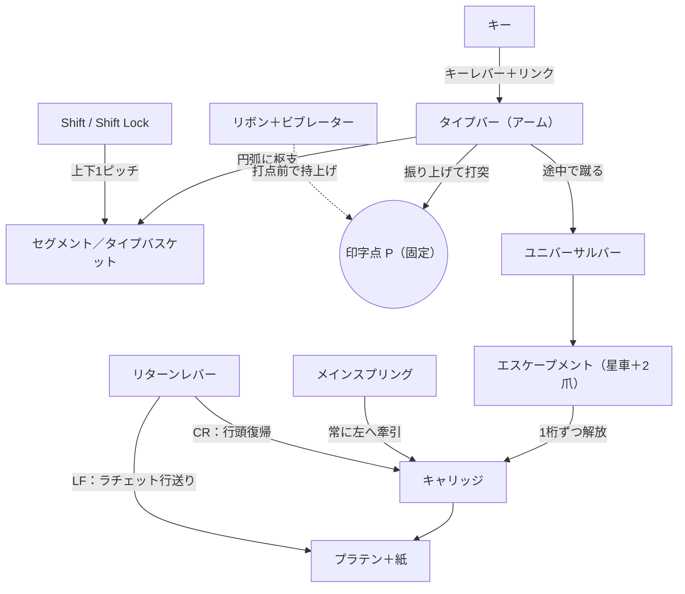
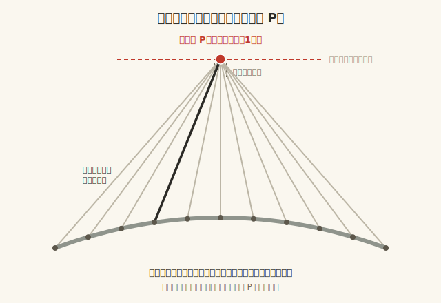
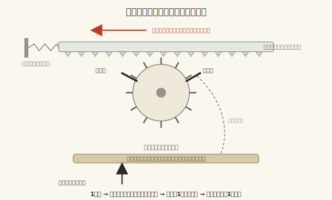
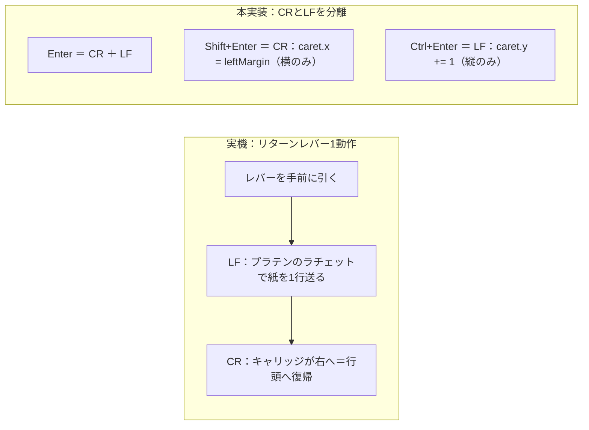
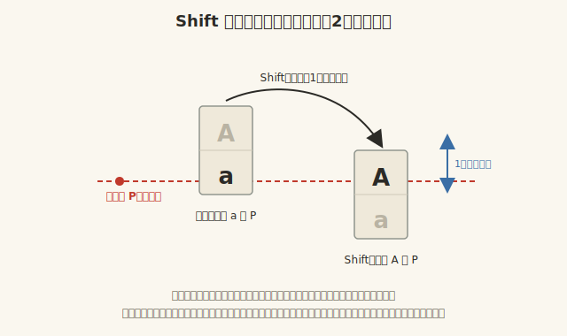
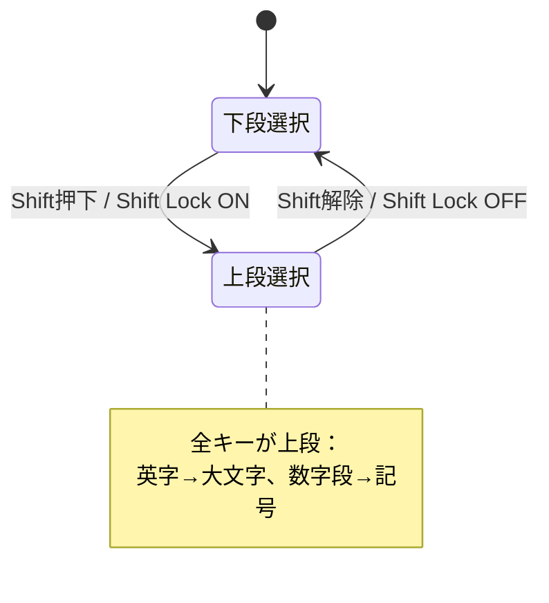
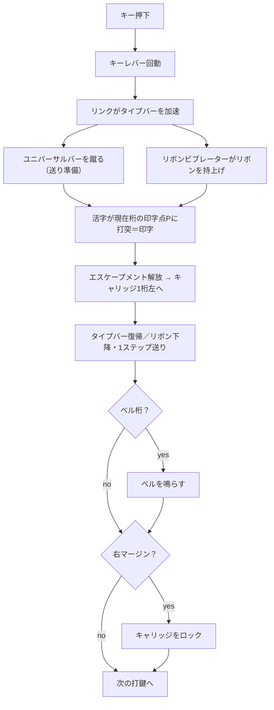

# 実装対象タイプライターの機械構造

本書は、本プロジェクトで再現する **廃れる直前＝最後期（おおむね1950〜60年代）の手動式・標準英文タイプライター** の機械構造を、実装に必要な範囲でまとめたものです。各機構を「ソフトウェア上どう表現するか」とあわせて記述します。

> 図は `docs/figures/` にSVGで置いています（GitHub・VS Codeプレビューで表示されます）。

---

## 0. 対象機種と前提

参照画像は **4段QWERTYの「標準タイプライター」盤面**（タッチタイプ運指図つき）で、現行コードの AIR MAIL（3段＋FIG.キー）とは別系統です。本プロジェクトの確定方針は次のとおり。

| 項目 | 方針 | 備考 |
|---|---|---|
| 盤面 | 画像どおりの **4段QWERTY 標準配列** | 記号段・1/0独立キーあり |
| シフト | **単一SHIFT 方式**（FIG.図形シフトは廃止） | 各活字に上下2文字 |
| シフトロック | **全段に作用**（英字→大文字＋数字段→記号） | 現代CapsLock=英字のみ とは別物 |
| シフト機構 | **セグメントシフト**（後期式・軽量） | 紙は跳ねず活字バスケットが動く |
| CR/LF | **分離して扱う** | Enter=CR+LF, Shift+Enter=CR, Ctrl+Enter=LF |

> つまり今回は「FIG.方式 → 標準SHIFT方式」「キャリッジシフト → セグメントシフト」への転換を含みます。

---

## 1. 全体構成

主要部品と力の流れの俯瞰。

中心となる不変条件は2つ。
1. **印字位置は「桁・行」だけで決まり、どのアームかには依存しない**（→ §2）。
2. **横送りは1打鍵=1桁、キーに依らず一定**（→ §3）。

---

## 2. キーとアーム（タイプバー）／共通打点

**伝達経路：キー → キーレバー → リンク → タイプバー → 活字（タイプスラグ）**

- **キーレバー**：キートップを押すと支点を中心に天秤運動。
- **リンク**：その動きをタイプバーに伝達・加速。後期機はトグル的機構で軽い打鍵でも勢いよく飛ぶ。
- **タイプバー（アーム＝ハンマー）**：先端の **タイプスラグに上下2文字** が鋳込まれる（例 `a`/`A`、`2`/`"`）。どちらが当たるかは Shift 状態で決まる（→ §5）。
- **復帰**：打突後はスプリングでバスケット（休止位置）へ戻る。

### アームの配置形状と「全アーム共通の打点」

- **セグメント（タイプバスケット）**：タイプバーの枢軸を並べた **半円弧状のスロット**。全タイプバーがこの円弧に放射状に枢支される。
- **共通打点（printing point, P）**：各タイプバーは枢軸位置も長さも異なるが、**振り上げると必ず空間上の同一点 P に活字面が到達する** よう、長さ・湾曲・枢軸位置が設計されている。これが「どのキーでも同じ場所を叩く」の正体。
- **タイプガイド**：P の直前に活字を通すフォーク状ガイド。行・桁の微小ブレを抑え毎回同じ位置・同じベースラインに当てる。
- 打点の裏当てが **プラテン（紙）**、間を **リボン** が通る。

> **実装上の最重要帰結**：紙への印字位置は「どのアームか」では決まらず **キャリッジ位置（桁）と行だけ** で決まる。アームの振り上げは常に固定点 P に収束する **演出** として扱えばよい（現コード `script.js` の `strike` 描画がこれに相当）。

---

## 3. キャリッジと横送り機構（エスケープメント）

### キャリッジ
- **キャリッジ**＝プラテン＋紙＋送り機構を載せた台。上部レールを左右に走る。
- **メインスプリング（ドラム）** が常にキャリッジを **左へ** 引く。1文字ごとに1コマ左進し、文字が左→右に並ぶ。

### エスケープメント（送り機構の心臓）
- キャリッジ下面の **ラック（歯竿）** が **星車（エスケープメントホイール）** と噛む。
- 星車を **2枚の爪（固定爪＋揺動爪）** が交互に押さえ、1回の解放＝1歯＝1桁だけ左進を許す。
- **ユニバーサルバー**：全タイプバーの下を横断する1本のバー。**どのキー（およびスペースバー）でも** 打鍵途中でこれを蹴り、エスケープメントを1コマ解放する。→ **キーに依らず必ず1桁送り**。
- 順序は **「印字 → 1桁送り」**（現コードの「現在桁に印字 → `caret.x++`」と一致）。

### スペースバー
- タイプバーを上げずに **ユニバーサルバーだけ蹴る** → 印字せず1桁左送り。

### バックスペース（CR/LFとは独立）
- 専用カムで星車を **逆に1歯** 回す → キャリッジが **右へ1桁** 戻る。**消去はしない**（重ね打ち・下線・アクセント・訂正用）。実装は `caret.x = max(leftMargin, caret.x-1)`。

### マージン・ベル・ロック・マージンリリース
- **マージンストップ**：マージンラックに左右の停止位置を設定。
- **ベル**：右マージンの **手前数桁（概ね5〜8桁前）** でトリップしてチン（現コードの `BELL_COL = COLS-8` 相当）。
- **右マージンでロック**：停止位置に達すると送りが止まりキーがロック（現コードの `sndLock`／`caret.x>=COLS` で打てない挙動）。
- **マージンリリース**（画像右上）：マージンストップを一時解除し、マージンを越えて打てる。

### プラテン周り（紙保持）
- **プラテン**（ゴムローラー）に **フィードローラー** が紙を圧着、**ペーパーベイル**（上部の押えローラー棒）で紙を平らに保持。
- **用紙リリースレバー**：フィードローラーを緩めて紙の抜き差し・曲がり直し。

---

## 4. 紙送り：キャリッジリターン（CR）とラインフィード（LF）

実機では **リターンレバー（左側）1動作** で「LF → CR」が連続して起きる（参考記事）。本プロジェクトでは **CR と LF を独立2動作に分離** する。

| 動作 | 機構 | 効果 | 実装 |
|---|---|---|---|
| **LF** | プラテンの行送りラチェット（行間レバーで1/1.5/2行） | 紙を縦に送る（横は不動） | `caret.y += 1` |
| **CR** | キャリッジが左マージンへ復帰 | 横を行頭へ戻す（縦は不動） | `caret.x = leftMargin` |
| **CR+LF** | レバー1動作の合成 | 通常の改行 | 両方 |

- **プラテンノブ**（両端）：ラチェットと別に手動でプラテンを回し縦位置を微調整（本実装では未搭載）。
- **バリアブル（フリー行送り）**：左ノブを押し込むとラチェットを解放し連続回転＝行に縛られない微調整。

---

## 5. Shift とシフトロック（キャリッジシフト／セグメントシフト）

### 原理（両方式共通）
活字スラグの **上下2文字のどちら** を固定打点 P に合わせるか、を **活字とプラテンの相対上下位置** を1文字分ずらして選ぶ。

- 休止：下段文字（小文字・数字）が P に合う。
- Shift：相対位置を活字2文字間の距離（1ピッチ）だけずらし、上段文字（大文字・記号）が P に合う。
- **重要**：ずれるのは縦方向のみで、**印字されるベースライン（行位置）は変わらない**（スラグ側オフセットで相殺）。→ 実装では Shift は **グリフ選択のみ**、y 印字位置は変えない。視覚的な“跳ね”は演出。

### 2方式の比較

| 方式 | 動く部品 | 重さ・速さ | 時代 | 印字済みの紙の見え方 | 本実装 |
|---|---|---|---|---|---|
| **キャリッジシフト** | キャリッジ全体（プラテン＋紙） | 重い・遅い | 旧式 | 跳ねる | （旧コードの `.carriage translateY` がこの表現） |
| **セグメントシフト** | 活字バスケット（セグメント）だけ | 軽い・速い | 後期 | 動かない | **◎ 採用** |

- **セグメントシフト採用の含意**：紙（プラテン／印字済み文字）は跳ねさせない。動かすなら **キーボード／バスケット側** を1ピッチ。現コードの `.carriage` の上下は外すのが正確。
- **シフトロック（SHIFT LOCK）**：シフトを押し下げ位置で **機械的にラッチ**。標準機では **全キーが上段** になる（英字＝大文字、数字段＝記号も）。
  - ⚠ 現代の Caps Lock（英字だけ大文字・数字段は無効）とは別物。実装で「CapsLock＝Shift Lock」とするなら **記号段にも作用** させるのが正しい。

---

## 6. リボン機構

- **2スプール** 間を走るインクリボン。**リボンビブレーター** が打鍵の瞬間だけリボンを打点前へ **持ち上げ**、直後に下げる（打った文字が隠れないように）。
- 打鍵ごとにリボンを **1ステップ送り**、終端でスプール **自動反転**。
- **リボン色選択（画像 RIBBON KEY）**：黒／赤バイクロームの上下半分を選択、または **ステンシル位置（リボン無効）**。→ **実装済**：蓋右端のリボン色スイッチ（青インク／黒／赤インク）。打鍵文字ごとに色を保持。

---

## 7. その他

- **タイプガイド／印字点**：§2参照。毎回同じ位置・ベースラインを保証する要。
- **（10進）タビュレータ**（画像の `· 1 10 100 1000`）：押すとキャリッジが設定タブ位置（1の位／10の位…）まで一気に走る。数字の桁揃え用。必須範囲外なら後回し可（横移動の特殊版として `caret.x` をタブ位置へジャンプ）。
- **運指図**（画像下の手のイラスト）：機構ではなくタッチタイプの指割り当て。盤面レイアウトの妥当性確認に使える。

---

## 8. 1打鍵の動作サイクル（実装の基準シーケンス）

---

## 9. 状態モデルと実装マッピング

`script.js` は桁 `caret.x`・行 `caret.y` を基本状態に持つ。各機構の対応は次のとおり。

| 機構 | ソフト状態／処理 | 現コードとの差分 |
|---|---|---|
| 共通打点 P | 印字位置＝`caret.x/y` のみで決定。アームは演出 | 維持 |
| エスケープメント | 印字 → `caret.x++`、`COLS` で停止 | 維持 |
| スペース | 印字せず `caret.x++` | 維持 |
| バックスペース | `caret.x = max(leftMargin, caret.x-1)` | 維持 |
| ベル／右マージン | `BELL_COL` でベル、上限でロック音 | 維持 |
| **CR** | `caret.x = leftMargin`（横のみ） | 維持 |
| **LF** | `caret.y += 1`（縦のみ）＋行間1/1.5/2 | **実装済**：蓋右端の行間スイッチ（青1.0/白1.5/赤2.0） |
| **Shift** | **upper/lower グリフ選択のみ**、y不変 | **FIG.方式→単一SHIFTへ要改修**（数字段＝記号） |
| **Shift Lock** | 全キー上段固定 | **CapsLock=英字のみ ではなく全段に作用** |
| シフト演出 | **セグメントシフト＝紙は不動／バスケットを動かす** | `.carriage` の上下を **やめ**、キーボード側を動かす |
| リボン | 色（青/黒/赤）＝`inkColor`、文字ごとに `stamp.ink` 保持 | **実装済**（色） |
| タビュレータ | `caret.x` をタブ位置へジャンプ | 新規（任意） |

---

## 用語集

| 用語 | 説明 |
|---|---|
| タイプバー（アーム／ハンマー） | 先端に活字スラグを持ち、振り上げて打点を叩く棒 |
| タイプスラグ | タイプバー先端の活字。上下2文字を鋳込む |
| セグメント／タイプバスケット | タイプバーの枢軸を並べた半円弧スロット |
| 印字点（printing point, P） | 全アームが収束する空間上の固定打点 |
| エスケープメント | 星車＋2爪でキャリッジの横送りを1桁ずつ刻む機構 |
| ユニバーサルバー | 全タイプバー・スペース共通の、送りを起動する横バー |
| プラテン | 紙を巻くゴムローラー。打点の裏当て |
| ラチェット（行送り） | プラテンを行単位で回す爪歯車。LFの実体 |
| マージンストップ／リリース | 左右端の停止位置設定／その一時解除 |

---

## 実装状況（2026-06-23）

本仕様は実装済み。

- **ロジック中核（状態機械）**：[`typewriter-model.js`](../typewriter-model.js) — 純粋関数・DOM非依存。`test/typewriter-model.test.js` を `node --test` で検証（18件パス）。
- **表示/入力層**：[`script.js`](../script.js) — モデルの `LAYOUT` からキーボード生成、canvas描画、Web Audio、物理キー／ポインタ入力。
- 反映済みの設計判断：単一SHIFT＋**全段に効く Shift Lock**、**セグメントシフト（紙は不動）**、**CR/LF分離**（Enter=CR+LF, Shift+Enter=CR, Ctrl+Enter=LF）、Backspaceは重ね打ち（消去なし）。
- 記号配列（§0表の `up`）は `typewriter-model.js` の `LAYOUT` 一箇所で定義。実機に合わせて差し替え可能。
- **描画モデル**：印字点は画面上で**固定**。打鍵すると**紙（キャリッジ）が動く**（横送りで左へ、CRで右へ復帰、LFで上へ）。プラテンはcanvas内に描画しキャリッジと一緒に横移動。各打鍵で**ハンマー（タイプバー）が固定印字点へ振り上がる**アニメーション（§2の共通打点を可視化）。
- **用紙解放**：**Esc** または右の解放レバー（`#paperRelease` / `toggleRelease`）。紙を `#sheetView`（fixed・中央寄せ・長い紙はスクロール）へ移して**画面中央に拡大提示**、背面の機械は減光、解放中はレバー非表示。Esc／紙クリックで復帰。
- **外観（アンティーク風）**：キーは**黒い円形・白字・金属リングの縁影**。配列は実機準拠＝Backspace(◂◂)はPの右、Shift LockはAの左、左ShiftはZの左、右Shiftは `?/` の右、Spaceは幅広の単独行。
- **キーの機構（扇形のタイプバスケット＝蓋＋`#lid` canvas）**：紙とキーボードの間の**蓋パネル**に開いた**扇形の穴**から、型かご（folding fan）が見える自己完結 canvas（`drawFan`）。旧 `#mech` 全面オーバーレイは廃止。扇は大きめ（蓋高さ ~168px）。
  - **構成**：暗い**扇形の穴**＝機械内部の開口。外周に**銀のスラグ（ハンマー頭）**、外周→中心の**放射状タイプバー（骨）**、印字点直下の実体**ハブ（扇子の持ち手）**。
  - **打鍵→アームのスイング**：打たれたキーのアームは休止位置から外れ、明るい棒＋スラグが弧の外側から**印字点へ振り上がる**（`fanStrike`）。どのアームが動いたか明確。
  - **キー↔アームは左右位置で一致**：`buildFanOrder()` が各キーの画面上 x でアームを割り当て（左キー＝左アーム／右キー＝右アーム）。
- **Shift Lock の状態反映**：Shift Lock を掛けるとシフトが機械的に保持されるため、両 Shift キーも点灯（held）する（`physDown || latch || isShiftLocked()`）。
- **マージンベル**：右端の手前（`bellCol = cols-8`）で1行に1度鳴る（CRで再アーム）。音は**自転車ベル**を解析して合成（~5100Hz, `sndBell`）。
- **CRレバーの操作**：右へ引く＝CR、手前（下）へ引く＝LF、ただ引く（クリック）＝CR+LF。**CRで右へスイング／LFで手前に倒れるアニメ**（reduced-motion でも動かす）。
- **蓋の2スイッチ**（`setupSwitch()` で共通化。3ポジション＝クロムのノブが選択位置へスライド、切替時に**「パチッ」**`sndSwitch`）:
  - **行間スイッチ**（蓋**左**端 `#lineSwitch`、上から **1 / 1.5 / 2**）：`lineHeight`→`lineAdvance()=round(FS*lineHeight)`。各行の縦位置は累積 `rowTop[]` に保持。
  - **リボン色スイッチ**（蓋**右**端 `#ribbonSwitch`、上から **青インク / 黒 / 赤インク**＝くすんだ色）：選択色を `inkColor`(r,g,b) に。打鍵文字は `stamp.ink` に色を保持し、リボン切替で以後の打鍵色が変わる（既存文字は不変）。
- **エスケープメントの演出**：打鍵→文字が印字点に出る→**約100ms後に紙が1桁左送り**（`colTarget`/`STEP_DELAY`）。「打ってから紙が動く」を再現。横送りは left（英文を左→右に書くため）。
- **効果音（実音準拠の合成）**：ユーザ提供のフリー音源を **ffmpeg + Goertzel** で解析し主要周波数に合わせて Web Audio で合成（全音は compressor バス経由）。Enter(CR)＝**レジの「チン」を2連**（~6674/10510Hz, `sndCR`/`regChing`）、用紙解放＝**ページめくり**（帯域ノイズのスワッシュ, `sndRelease`）、マージンベル＝**自転車ベル**（`sndBell`）、行間スイッチ＝**パチッ**（`sndSwitch`）。
- **リボン＋プラテン（実機動画 Erika 準拠, 2026-06-23）**：扇は **約150°** に展開（`drawFan` の `PHI=75`）。印字点に**選択インク色のリボン**バンドを置き、打鍵で持ち上げてスラグが叩く（実機の動き）。紙は**黒いプラテン・ローラーに巻かれた表示**（`drawPlaten`）＝上から 用紙の裏面 → 黒ローラー（円柱）→ 用紙の上端 → 前面の用紙＋文字 → ペーパーベイル（クロム棒＋ゴムローラー）。**1行目はローラーが大きく見え、改行で上端が巻き上がりローラーが縮む**＝紙が platen から出てくる演出。前面に見えるのは数行のみ（`VIS_ROWS=5`）＝実機的。打鍵文字の色はリボン色（`stamp.ink`）。用紙解放(Esc)時はプラテン演出を消し、全頁を中央表示。**紙はローラーより少し狭く**（`OVER=20` インセット）、黒ローラーの左右端が紙の外にのぞく。リボンは幅広（spool-to-spool）。**CRレバーは `.lever-mount`（クロムの土台）でキャリッジに金属接続**（宙吊りにしない）。
- **リボン構造・CR動作(2026-06-24)**：リボンは**両脇のスプール→印字点のガイド金具**へ上がる形。休止時は頂上の狭い**台形**、打鍵時は**打点を頂上とする張った三角形**に引かれる。アーム先端のヘッドが紙の印字位置を覆ってリボンを押し当てる（`drawStrike`）。**行間スイッチ＝紙幅レスポンシブ**（`pageW=deckW-2*FRAME`、フォントを縮めてCOLS列を収める＝ローラー枠込み≒マシン幅、はみ出さない）。**マージンベル＝自転車のチリーン**。**CR＝レバー先端を右へ押し、キャリッジが右へスライド**（距離に比例・全幅で最大約1秒・その間は入力ブロック。行頭では＝改行連打時はスライドせずLFのみ）。CR音はキャリッジを引く機械音。
- **開発サーバ**：`.claude/launch.json` は `serve.py`（no-store ヘッダ付き静的サーバ, :8123）。編集が確実にリロード反映される。

## 出典・参考

- キャリッジリターン／ラインフィードの仕組み（リターンレバー1動作でLF＋CR、右端でベル、行間レバー）：<https://www.granfairs.com/blog/entry-3152/>
- 盤面・運指：本プロジェクト同梱の標準タイプライター盤面図（画像）。

> 本書の方針（最後期・標準・単一SHIFT・セグメントシフト・CR/LF分離）は、実装時の設計判断の基準とする。変更が生じた場合は本書を更新すること。
